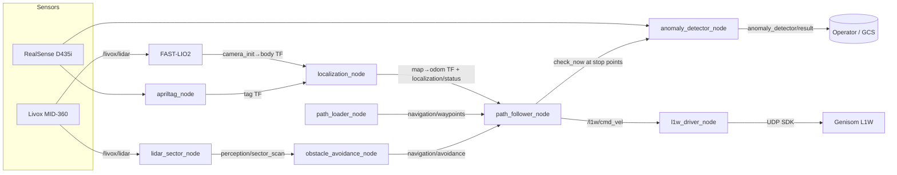

<div align="center">

# PASHUPATI

**Autonomous patrol & inspection stack for the Genisom L1W wheel-legged quadruped — LiDAR-inertial mapping, teach-and-repeat waypoint navigation, reactive obstacle avoidance, and VLM-based anomaly detection.**

[](https://docs.ros.org/en/humble/)
[](https://releases.ubuntu.com/22.04/)
[](https://www.python.org/)
[](LICENSE)

</div>

---

## Demo

<!-- record a GIF/MP4 of: record path → localize → start_nav → robot dwelling at a stop point in RViz, save it to docs/demo.gif, then re-add the embed below -->

<div align="center">

*Drive the route once, mark inspection stops, then let the robot repeat it — dodging people and flagging trash, spills, or fallen persons along the way.*

</div>

---

## Why this exists

Patrolling a mall corridor doesn't need a full Nav2 stack with a global costmap — the route is fixed, known, and repeated every shift. Pashupati takes a **teach-and-repeat** approach instead:

- **Teach once** — drive the robot manually while FAST-LIO2 tracks its pose, record the path, and mark inspection stop points with a dwell time.
- **Repeat autonomously** — the recording is resampled and smoothed, then followed by a swappable controller (`pure_pursuit` / `pid` / `mppi` / `lqr` / `stanley`) with a curvature-aware speed profile, blended with reactive avoidance (`braitenberg` / `vfh` / `potential_field` / `follow_gap`) on a 32-sector LiDAR scan.
- **Stop exactly** — at each stop point the robot converges onto x / y / yaw (strafing on the legged base) to within 5 cm / 3°, so every inspection is taken from the same pose.
- **Inspect while patrolling** — a local VLM (Moondream via Ollama) checks the camera feed for `trash`, `spill`, or `fallen_person`, triggered at every stop point.
- **Relocalize cheaply** — snap `map→odom` to a known AprilTag, an RViz 2D Pose Estimate, or the start marker.

## Hardware

| Component | Model | Role |
|---|---|---|
| Robot base | ZSBot **Genisom L1W** (wheel-legged quadruped) | `genisom_l1w_ros2` driver (zsibot SDK, UDP) |
| LiDAR | Livox **MID-360** | FAST-LIO2 odometry + obstacle sectors |
| Camera | Intel RealSense **D435i** | AprilTag relocalization + anomaly detection |
| Compute | NVIDIA Jetson (aarch64) | ROS2 Humble, Ollama |

## Architecture



## Packages

| Package | Type | Description |
|---|---|---|
| `robot_interfaces` | CMake | Msgs (`Waypoint`, `WaypointPath`, `SectorScan`, `AvoidanceCommand`, `NavigationStatus`, `MissionStatus`, `StopPointEvent`) and srvs (`LoadPath`, `MarkStopPoint`) |
| `robot_mapping` | Python | FAST-LIO2 bringup + `path_recorder_node` (TF → waypoint CSV) |
| `robot_localization` | Python | `localization_node` — FAST-LIO frame bridge, `map→odom` from AprilTag / RViz / start marker |
| `robot_navigation` | Python | `path_loader_node` (smoothing), `path_follower_node` (controllers, final approach, safety), `obstacle_avoidance_node` |
| `robot_perception` | Python | `lidar_sector_node` (Livox or PointCloud2 → `SectorScan`), AprilTag bringup |
| `robot_rviz` | C++ | RViz panel — localize, record, mark stop, load path, start/stop/pause, mission & battery |
| `xtras/drivers/genisom_l1w_ros2` | submodule | L1W driver, URDF and sensor bringup (`l1w_bringup`) |

## Quickstart

### 1. Prerequisites

- Ubuntu 22.04 + [ROS2 Humble](https://docs.ros.org/en/humble/Installation.html)
- zsibot SDK installed (`sudo make install` of [genisom_l1_sdk](https://github.com/zsibot/genisom_l1_sdk))
- [Livox-SDK2](https://github.com/Livox-SDK/Livox-SDK2) (required by `livox_ros_driver2`)
- [Ollama](https://ollama.com/) running locally for anomaly detection

### 2. Clone & build

```bash
mkdir -p ~/dev && cd ~/dev
git clone --recursive https://github.com/DarmawanRobotics/Pashupati.git
cd Pashupati

sudo apt install -y ros-humble-apriltag-ros ros-humble-tf-transformations \
                    ros-humble-cv-bridge python3-transforms3d

rosdep install --from-paths src --ignore-src -r -y
colcon build --symlink-install --packages-select robot_interfaces
colcon build --symlink-install
source install/setup.bash
```

### 3. Launch

```bash
./script/start_tmux.sh mapping   # teach: FAST-LIO saves the map, record a route
./script/start_tmux.sh patrol    # repeat: map saving off, navigation ready
```

`WS`, `ROUTE`, `TAGS` and `ROBOT_NS` can be overridden from the environment, e.g.
`ROUTE=map/2026-10-02/09-00-00_path.csv ./script/start_tmux.sh patrol`.

| Window | Panes |
|---|---|
| `robot` | `l1w_bringup`, FAST-LIO + localization, perception, RViz |
| `nav` | navigation (patrol mode), command pane |

## Workflow

### Teach — record a route

```bash
ros2 service call /mapping/path_record std_srvs/srv/SetBool "{data: true}"
# drive the robot manually; at each inspection point:
ros2 service call /mapping/mark_stop_point robot_interfaces/srv/MarkStopPoint "{dwell_sec: 10.0}"
# end where you started for a patrol loop, then stop and save
ros2 service call /mapping/path_record std_srvs/srv/SetBool "{data: false}"
```

Routes are saved to `map/<YYYY-MM-DD>/<HH-MM-SS>_path.csv`.

### Localize

Navigation refuses to start until `localization/status` reports a source:

```bash
ros2 service call /localization/start std_srvs/srv/Trigger   # snap to a visible AprilTag
```

or use **2D Pose Estimate** in RViz. To treat the start marker as the map origin without a tag,
set `assume_start_origin: true` in `localization_params.yaml`.

### Repeat — run the route

```bash
ros2 service call /navigation/load_path robot_interfaces/srv/LoadPath \
  "{waypoints_file: '/home/robot/dev/Pashupati/map/<date>/<time>_path.csv'}"

ros2 service call /navigation/start_nav std_srvs/srv/SetBool "{data: true}"
ros2 service call /navigation/pause     std_srvs/srv/SetBool "{data: true}"   # hold, keep progress
ros2 service call /navigation/start_nav std_srvs/srv/SetBool "{data: false}"
```

All of the above is also available from the **robot_rviz** panel.

### Emergency stop

```bash
ros2 service call /l1w/emergency_stop std_srvs/srv/Trigger
```

## Patrol behaviour

| Feature | What it does | Key parameters |
|---|---|---|
| Route smoothing | Dedup, resample, gradient smoothing between stop points; stops never move | `resample_spacing`, `smooth_weight_*` |
| Speed profile | Curvature speed cap, braking into stops and the route end | `max_lateral_accel`, `approach_speed` |
| Final approach | x / y / yaw convergence at stop points and the end of open routes | `holonomic`, `approach.*` |
| Inspection | Calls Trigger services after arriving, waits for them, then dwells | `inspection_services`, `inspection_timeout_sec` |
| Loop patrol | Restarts closed routes; ends the lap on low battery | `loop_route`, `low_battery_percentage` |
| Fail-safes | Stops on stale avoidance / odometry, e-stop hysteresis, `BLOCKED`, `OFF_PATH` | `*_timeout_sec`, `off_path_*` |
| Smooth commands | Slew limits plus low-pass on angular / lateral | `*_accel_limit`, `command_smoothing` |

## Runtime tuning

Controllers and avoidance algorithms are swappable live — no relaunch:

```bash
ros2 param set /path_follower_node controller lqr                  # pure_pursuit | pid | mppi | lqr | stanley
ros2 param set /path_follower_node avoidance_enabled false
ros2 param set /path_follower_node loop_route false
ros2 param set /obstacle_avoidance_node algorithm potential_field  # braitenberg | vfh | potential_field | follow_gap
```

Full parameter reference: [`src/robot_navigation/config/navigation_params.yaml`](src/robot_navigation/config/navigation_params.yaml)

## File formats

**Waypoint CSV** — `x, y, yaw_deg, dwell_sec` in the `map` frame. `dwell_sec > 0` marks an inspection stop (robot converges onto `x, y, yaw_deg`, inspects, then holds).

```csv
# x,y,yaw_deg,dwell_sec
0.0,0.0,0,0
1.0,0.0,0,0
2.0,0.5,45,5.0
```

**Tag config JSON** — known map pose per AprilTag TF frame:

```json
{
  "base_map":      { "x": 0.0, "y": 0.0, "z": 0.0, "qx": 0.0, "qy": 0.0, "qz": 0.0, "qw": 1.0 },
  "charging_dock": { "x": 2.5, "y": 1.0, "z": 0.0, "qx": 0.0, "qy": 0.0, "qz": 0.0, "qw": 1.0 }
}
```

Tag IDs → frame names are mapped in [`perception_params.yaml`](src/robot_perception/config/perception_params.yaml) (`tag.ids` / `tag.frames`).

## Interfaces

<details>
<summary><b>Services</b></summary>

| Service | Type | Node |
|---|---|---|
| `/mapping/path_record` | `std_srvs/SetBool` | path_recorder_node |
| `/mapping/mark_stop_point` | `robot_interfaces/MarkStopPoint` | path_recorder_node |
| `/localization/start` | `std_srvs/Trigger` | localization_node |
| `/navigation/load_path` | `robot_interfaces/LoadPath` | path_loader_node |
| `/navigation/start_nav` | `std_srvs/SetBool` | path_follower_node |
| `/navigation/pause` | `std_srvs/SetBool` | path_follower_node |
| `/l1w/<command>` | `std_srvs/Trigger` | l1w_driver_node (`stand_up`, `emergency_stop`, ...) |
| `/anomaly_detector_node/check_now` | `std_srvs/Trigger` | anomaly_detector_node |

</details>

<details>
<summary><b>Topics</b></summary>

| Topic | Type | Publisher |
|---|---|---|
| `/l1w/cmd_vel` | `geometry_msgs/Twist` | path_follower_node |
| `/l1w/battery` | `sensor_msgs/BatteryState` | l1w_driver_node |
| `/localization/status` | `std_msgs/String` (latched) | localization_node |
| `/navigation/path`, `/navigation/path_raw` | `nav_msgs/Path` | path_loader_node |
| `/navigation/waypoints` | `robot_interfaces/WaypointPath` (latched) | path_loader_node |
| `/navigation/avoidance` | `robot_interfaces/AvoidanceCommand` | obstacle_avoidance_node |
| `/navigation/status` | `robot_interfaces/NavigationStatus` | path_follower_node |
| `/navigation/mission_status` | `robot_interfaces/MissionStatus` (1 Hz) | path_follower_node |
| `/navigation/stop_point_event` | `robot_interfaces/StopPointEvent` | path_follower_node |
| `/navigation/markers` | `visualization_msgs/MarkerArray` | path_follower_node |
| `/perception/sector_scan` | `robot_interfaces/SectorScan` | lidar_sector_node |
| `/perception/obstacles` | `visualization_msgs/MarkerArray` | lidar_sector_node |
| `/anomaly_detector/result` | `std_msgs/String` (JSON) | anomaly_detector_node |

</details>

<details>
<summary><b>TF tree</b></summary>

```
map → odom → camera_init → body → base_link ─┬─ livox_frame → livox_imu_frame
 (localization_node)  (FAST-LIO2)  (bridge)   └─ camera_link → camera_*_optical_frame (realsense)
```

</details>

## Tests

```bash
colcon test --packages-select robot_navigation robot_localization robot_mapping
colcon test-result --verbose
```

The navigation tests drive every controller around a noisy closed loop and an overlapping
out-and-back corridor, and check smoothing, the speed profile, the final approach and avoidance.

## Repository layout

```
Pashupati/
├── map/                   # recorded routes (map/<date>/<time>_path.csv) + example/
├── script/start_tmux.sh   # bringup in a tmux session (mapping | patrol)
└── src/
    ├── robot_*/           # first-party packages (see table above)
    └── xtras/             # submodules: genisom_l1w_ros2, livox_ros_driver2, realsense-ros, FAST_LIO
```

## License

[Apache License 2.0](LICENSE) 