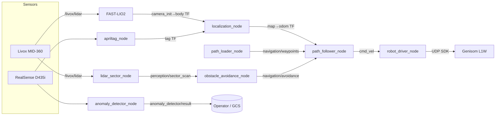

<div align="center">

# PASHUPATI

**Autonomous patrol & inspection stack for the Genisom L1W wheel-legged quadruped — LiDAR-inertial mapping, teach-and-repeat waypoint navigation, reactive obstacle avoidance, and VLM-based anomaly detection.**

[](https://docs.ros.org/en/humble/)
[](https://releases.ubuntu.com/22.04/)
[](https://www.python.org/)
[](LICENSE)

</div>

---

## Demo

<!-- record a GIF/MP4 of: record path → localize → start_nav → robot dwelling at a stop point in RViz, save it to docs/demo.gif, then re-add the embed below -->

<div align="center">

*Drive the route once, mark inspection stops, then let the robot repeat it — dodging people and flagging trash, spills, or fallen persons along the way.*

</div>

---

## Why this exists

Patrolling a mall corridor doesn't need a full Nav2 stack with a global costmap — the route is fixed, known, and repeated every shift. Pashupati takes a **teach-and-repeat** approach instead:

- **Teach once** — drive the robot manually while FAST-LIO2 tracks its pose, record the path, and mark inspection stop points with a dwell time.
- **Repeat autonomously** — a swappable path controller (`pure_pursuit` / `pid` / `mppi`) follows the recorded trajectory, blended with a reactive avoidance layer (`braitenberg` / `vfh`) on a 32-sector LiDAR scan.
- **Inspect while patrolling** — a local VLM (Moondream via Ollama) checks the camera feed for `trash`, `spill`, or `fallen_person`, with no cloud dependency.
- **Relocalize cheaply** — start on a floor marker, or snap `map→odom` to a known AprilTag / RViz 2D Pose Estimate.

## Hardware

| Component | Model | Role |
|---|---|---|
| Robot base | ZSBot **Genisom L1W** (wheel-legged quadruped) | Locomotion via `mc_sdk_zsl_1w_py` high-level SDK |
| LiDAR | Livox **MID-360** | FAST-LIO2 odometry + obstacle sectors |
| Camera | Intel RealSense **D435i** | AprilTag relocalization + anomaly detection |
| Compute | Onboard Linux (x86_64 / aarch64) | ROS2 Humble, Ollama |

## Architecture



## Packages

| Package | Type | Description |
|---|---|---|
| `robot_interfaces` | CMake | Custom msgs (`Waypoint`, `WaypointPath`, `SectorScan`, `AvoidanceCommand`, `NavigationStatus`, `MissionStatus`) and srvs (`LoadPath`, `MarkStopPoint`) |
| `robot_description` | CMake | URDF/xacro (base_link, MID-360, D435i mounts), RViz config |
| `robot_drivers` | Python | `robot_driver_node` — SDK bridge with cmd_vel watchdog, velocity clamping, auto/manual bind switching, e-stop; Livox + RealSense bringup |
| `robot_mapping` | Python | FAST-LIO2 bringup + `path_recorder_node` (TF → waypoint CSV) |
| `robot_localization` | Python | `localization_node` — sets `map→odom` from AprilTag or RViz 2D Pose Estimate |
| `robot_navigation` | Python | `path_loader_node`, `path_follower_node` (controller registry + stop-point state machine), `obstacle_avoidance_node` (avoidance registry) |
| `robot_perception` | Python | `lidar_sector_node` (MID-360 → `SectorScan`), `anomaly_detector_node` (Moondream/Ollama), AprilTag bringup |
| `robot_ui` | C++ | RViz panel — localize, record path, mark stop, load path, start/stop nav, battery & status readout |

## Quickstart

### 1. Prerequisites

- Ubuntu 22.04 + [ROS2 Humble](https://docs.ros.org/en/humble/Installation.html)
- Genisom L1 SDK installed at `/opt/genisom_l1_sdk` (must contain `lib/zsl-1w/<arch>/`)
- [Livox-SDK2](https://github.com/Livox-SDK/Livox-SDK2) (required by `livox_ros_driver2`)
- [Ollama](https://ollama.com/) running locally (the `moondream` model is pulled automatically on first launch)

### 2. Clone & build

```bash
mkdir -p ~/dev && cd ~/dev
git clone --recursive https://github.com/DarmawanRobotics/Pashupati.git
cd Pashupati

sudo apt install -y ros-humble-apriltag-ros ros-humble-tf-transformations \
                    ros-humble-cv-bridge python3-transforms3d
pip install ollama

rosdep install --from-paths src --ignore-src -r -y
colcon build --symlink-install
source install/setup.bash
```

### 3. Network

The driver talks to the robot over UDP. Put the compute on the robot's subnet:

| Param | Default |
|---|---|
| `dog_ip` | `192.168.234.1` |
| `local_ip` | `192.168.234.234` |
| `local_port` | `43988` |

Edit in [`src/robot_drivers/config/sdk_brigde_param.yaml`](src/robot_drivers/config/sdk_brigde_param.yaml).

### 4. Launch everything

```bash
./script/start_tmux.sh
```

Opens a `pashupati` tmux session with two windows:

| Window | Panes |
|---|---|
| `panel1` | description + RViz, sensor drivers, mapping, perception |
| `panel2` | navigation, localization, SDK bridge, command pane |

## Workflow

### Teach — record a route

```bash
# start recording (saves to map/<YYYY-MM-DD>/<HH-MM-SS>_path.csv)
ros2 service call /mapping/path_record std_srvs/srv/SetBool "{data: true}"

# drive the robot manually; at each inspection point:
ros2 service call /mapping/mark_stop_point robot_interfaces/srv/MarkStopPoint "{dwell_sec: 5.0}"

# stop and save
ros2 service call /mapping/path_record std_srvs/srv/SetBool "{data: false}"
```

### Localize

Place the robot on the start marker (identity `map→odom` by default), or:

```bash
# snap to a visible AprilTag configured in tag_config.json
ros2 service call /localization/start std_srvs/srv/Trigger
```

or use **2D Pose Estimate** in RViz.

### Repeat — run the route

```bash
ros2 service call /navigation/load_path robot_interfaces/srv/LoadPath \
  "{waypoints_file: '/home/robot/dev/Pashupati/map/<date>/<time>_path.csv'}"

ros2 service call /navigation/start_nav std_srvs/srv/SetBool "{data: true}"   # binds SDK + stands up
ros2 service call /navigation/start_nav std_srvs/srv/SetBool "{data: false}"  # stops + releases to manual
```

All of the above is also available from the **robot_ui** RViz panel.

### Emergency stop

```bash
ros2 service call /drivers/emergency_stop std_srvs/srv/Trigger
```

Stops, switches to passive/damping, and unbinds the SDK so the handheld remote regains control.

## Runtime tuning

Controllers and avoidance algorithms are swappable live — no relaunch:

```bash
ros2 param set /path_follower_node controller pure_pursuit        # pure_pursuit | pid | mppi
ros2 param set /path_follower_node avoidance_enabled false
ros2 param set /path_follower_node speed_regulator_enabled true
ros2 param set /obstacle_avoidance_node algorithm vfh             # braitenberg | vfh
```

Full parameter reference: [`src/robot_navigation/config/navigation_params.yaml`](src/robot_navigation/config/navigation_params.yaml)

## File formats

**Waypoint CSV** — `x, y, yaw_deg, dwell_sec` in the `map` frame. `dwell_sec > 0` marks an inspection stop (robot aligns to `yaw_deg`, then holds).

```csv
# x,y,yaw_deg,dwell_sec
0.0,0.0,0,0
1.0,0.0,0,0
2.0,0.5,45,5.0
```

**Tag config JSON** — known map pose per AprilTag TF frame:

```json
{
  "base_map":      { "x": 0.0, "y": 0.0, "z": 0.0, "qx": 0.0, "qy": 0.0, "qz": 0.0, "qw": 1.0 },
  "charging_dock": { "x": 2.5, "y": 1.0, "z": 0.0, "qx": 0.0, "qy": 0.0, "qz": 0.0, "qw": 1.0 }
}
```

Tag IDs → frame names are mapped in [`perception_params.yaml`](src/robot_perception/config/perception_params.yaml) (`tag.ids` / `tag.frames`).

## Interfaces

<details>
<summary><b>Services</b></summary>

| Service | Type | Node |
|---|---|---|
| `/drivers/set_auto_mode` | `std_srvs/SetBool` | robot_driver_node |
| `/drivers/stand_up` | `std_srvs/SetBool` | robot_driver_node |
| `/drivers/emergency_stop` | `std_srvs/Trigger` | robot_driver_node |
| `/mapping/path_record` | `std_srvs/SetBool` | path_recorder_node |
| `/mapping/mark_stop_point` | `robot_interfaces/MarkStopPoint` | path_recorder_node |
| `/localization/start` | `std_srvs/Trigger` | localization_node |
| `/navigation/load_path` | `robot_interfaces/LoadPath` | path_loader_node |
| `/navigation/start_nav` | `std_srvs/SetBool` | path_follower_node |
| `/anomaly_detector_node/check_now` | `std_srvs/Trigger` | anomaly_detector_node |

</details>

<details>
<summary><b>Topics</b></summary>

| Topic | Type | Publisher |
|---|---|---|
| `/cmd_vel` | `geometry_msgs/Twist` | path_follower_node |
| `/drivers/battery` | `sensor_msgs/BatteryState` | robot_driver_node |
| `/drivers/robot_state` | `std_msgs/String` | robot_driver_node |
| `/navigation/path` | `nav_msgs/Path` | path_loader_node |
| `/navigation/waypoints` | `robot_interfaces/WaypointPath` | path_loader_node |
| `/navigation/avoidance` | `robot_interfaces/AvoidanceCommand` | obstacle_avoidance_node |
| `/navigation/status` | `robot_interfaces/NavigationStatus` | path_follower_node |
| `/navigation/markers` | `visualization_msgs/MarkerArray` | path_follower_node |
| `/perception/sector_scan` | `robot_interfaces/SectorScan` | lidar_sector_node |
| `/perception/obstacles` | `visualization_msgs/MarkerArray` | lidar_sector_node |
| `/anomaly_detector/result` | `std_msgs/String` (JSON) | anomaly_detector_node |
| `/anomaly_detector/is_anomaly` | `std_msgs/Bool` | anomaly_detector_node |
| `/anomaly_detector/annotated_image` | `sensor_msgs/Image` | anomaly_detector_node |

</details>

<details>
<summary><b>TF tree</b></summary>

```
map → odom → camera_init → body → base_link ─┬─ livox_frame → livox_imu_frame
 (localization_node)  (FAST-LIO2)            └─ camera_link → camera_color_optical_frame
```

</details>

## Repository layout

```
Pashupati/
├── map/                   # recorded routes (map/<date>/<time>_path.csv) + example/
├── script/start_tmux.sh   # full bringup in a tmux session
└── src/
    ├── robot_*/           # first-party packages (see table above)
    └── xtras/             # git submodules: livox_ros_driver2, realsense-ros, FAST_LIO
```

## License

[Apache License 2.0](LICENSE) 