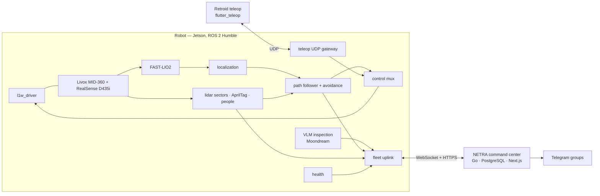

<div align="center">

# PASHUPATI

**Autonomous patrol & inspection stack for the Genisom L1W wheel-legged quadruped — LiDAR-inertial teach-and-repeat navigation, reactive avoidance, on-robot VLM inspection, crowd sensing, handheld teleop and the NETRA command center.**

[](https://docs.ros.org/en/humble/)
[](https://releases.ubuntu.com/22.04/)
[](https://www.python.org/)
[](LICENSE)

</div>

---

## What it does

Mall corridors are patrolled on fixed routes every shift, so Pashupati uses **teach and repeat**
instead of a global planner:

- **Teach** — drive the robot once (handheld or RViz) while FAST-LIO2 tracks it, mark inspection
  stops, record the AprilTags that anchor the map. The route is uploaded to NETRA automatically.
- **Repeat** — routes are resampled and smoothed, followed by a swappable controller with a
  curvature-aware speed profile, blended with reactive avoidance on a 32-sector LiDAR scan; at
  every stop the robot converges to 5 cm / 3° and inspects.
- **Inspect** — Moondream (local VLM via Ollama) checks each stop for trash, spills, floor damage
  or a fallen person; findings go to NETRA for final detection, validation and Telegram alerts.
- **Sense crowds** — people seen by the camera are placed on the floor plan and aggregated into
  per-minute crowd heatmaps.
- **Operate** — schedules and live control from NETRA, manual control from a Retroid handheld
  over UDP, one supervised systemd service on the robot with self-respawning nodes.

## System



| Repository | |
|---|---|
| **Pashupati** (this) | robot workspace |
| [`genisom_l1w_ros2`](src/xtras/drivers/genisom_l1w_ros2) | L1W driver, URDF, sensor bringup, SDK installer (submodule) |
| `netra` | command center: backend, dashboard, VPS deployment |
| `flutter_teleop` | handheld teleop app (Retroid Pocket / Android) |

## Hardware

| Component | Model | Role |
|---|---|---|
| Robot base | ZSBot **Genisom L1W** | `genisom_l1w_ros2` (zsibot SDK, UDP) |
| LiDAR | Livox **MID-360** | FAST-LIO2 odometry, obstacle sectors, teleop lidar view |
| Camera | Intel RealSense **D435i** | AprilTags, VLM inspection, people, teleop video |
| Compute | NVIDIA Jetson (aarch64) | ROS 2 Humble, Ollama, TensorRT |

## Packages

| Package | Role |
|---|---|
| [`robot_interfaces`](src/robot_interfaces) | messages and services |
| [`robot_mapping`](src/robot_mapping) | FAST-LIO2 bringup, route recording |
| [`robot_localization`](src/robot_localization) | FAST-LIO frame bridge, `map→odom` from AprilTags / RViz, tag recording |
| [`robot_perception`](src/robot_perception) | LiDAR sectors, AprilTag, person detection |
| [`robot_navigation`](src/robot_navigation) | route processing, 5 controllers, 4 avoidance algorithms, final approach, safety |
| [`robot_bridge`](src/robot_bridge) | auto/remote control mux, UDP teleop gateway ([protocol](src/robot_bridge/PROTOCOL.md)) |
| [`robot_fleet`](src/robot_fleet) | NETRA uplink: telemetry, events, crowd, anomalies, routes ([API](src/robot_fleet/API.md)) |
| [`robot_inspection`](src/robot_inspection) | Moondream anomaly detection at stop points |
| [`robot_health`](src/robot_health) | sensor-rate and computer health |
| [`robot_rviz`](src/robot_rviz) | RViz panels: Mission, Status, Tuning, AprilTags |
| [`pashupati_bringup`](src/pashupati_bringup) | production launch with respawning nodes |

## Install on the robot

```bash
git clone --recursive https://github.com/DarmawanRobotics/Pashupati.git ~/dev/Pashupati
cd ~/dev/Pashupati
script/setup.sh                 # what is installed / missing
script/setup.sh install         # tools, submodules, Livox-SDK2, zsibot SDK, rosdep, udev, Ollama + moondream, build
script/setup.sh install service # systemd service, /etc/pashupati/pashupati.env
sudoedit /etc/pashupati/pashupati.env   # route, tags, NETRA url + token
sudo systemctl start pashupati && journalctl -fu pashupati
```

The service runs `pashupati_bringup/robot.launch.py` (`script/run_robot.sh`) with
`Restart=always`; every Pashupati node respawns on its own, the last loaded route is reloaded after a
restart. Person detection needs Ultralytics and a TensorRT engine (`script/setup.sh install
people_model` prints the Jetson steps) or `PEOPLE=false`.

## Develop (macOS / Linux)

```bash
script/dev.sh up      # Docker: ROS 2 Humble + all deps + XFCE desktop over VNC
script/dev.sh build   # colcon build (symlink-install, Release)
script/dev.sh test
script/dev.sh vnc     # TigerVNC localhost:5901 or http://localhost:6080/vnc.html
```

On the robot during development: `script/start_tmux.sh mapping|patrol` (one pane per part, RViz).

## Workflow

### Teach

1. Start in mapping mode (`MODE=mapping` in the env file, or `start_tmux.sh mapping`).
2. Take the handheld, switch to **REMOTE**, hold the deadman and drive the route; **Rekam rute**
   starts recording, **Titik stop** marks inspection stops with a dwell time (or the RViz Mission
   panel, or `mapping/path_record` / `mapping/mark_stop_point`).
3. Stand still in view of each AprilTag and **Record Tag Poses** (AprilTags panel or
   `localization/record_tags`) — tags recorded in the same session anchor the same map frame.
4. Stop recording: the route is saved under `map/<date>/` and uploaded to NETRA. End near the start
   for a looping patrol.

### Repeat

- **Localize** from a tag (teleop, panel or `localization/start`); navigation refuses to start
  until `localization/status` reports a source.
- **Start** from NETRA (now or weekly schedule), the handheld (**Rute** → load, **Mulai nav**) or:

```bash
ros2 service call /navigation/load_path robot_interfaces/srv/LoadPath "{waypoints_file: '/home/robot/dev/Pashupati/map/<date>/<time>_path.csv'}"
ros2 service call /navigation/start_nav std_srvs/srv/SetBool "{data: true}"
```

- At every stop the robot converges, calls `/anomaly_detector_node/check_now`, dwells and moves on;
  anomalies, crowd windows and stop events flow to NETRA.

### Emergency stop

Handheld **E-STOP** (screen or gamepad B), or `ros2 service call /l1w/emergency_stop std_srvs/srv/Trigger`.

## Patrol behaviour

| Feature | What it does | Key parameters |
|---|---|---|
| Route processing | dedup, resample, gradient smoothing between stop points; stops never move | `resample_spacing`, `smooth_weight_*` |
| Controllers | `pure_pursuit`, `pid`, `mppi`, `lqr`, `stanley`, switchable live | `controller`, `<controller>.*` |
| Speed profile | curvature speed cap, braking into stops and the route end | `max_lateral_accel`, `approach_speed` |
| Avoidance | `braitenberg`, `vfh`, `potential_field` (lateral push), `follow_gap` | `algorithm`, `safe_distance` |
| Final approach | x / y / yaw convergence (strafing) to 5 cm / 3° | `holonomic`, `approach.*` |
| Inspection | VLM check at each stop, waits for the result, then dwells | `inspection_services`, `inspection_timeout_sec` |
| Loop patrol | restarts closed routes, ends the lap on low battery | `loop_route`, `low_battery_percentage` |
| Safety | stops on stale avoidance / odometry, e-stop hysteresis, `BLOCKED`, `OFF_PATH`, teleop watchdog | `*_timeout_sec`, `off_path_*` |
| Control mux | AUTO (navigation) or REMOTE (handheld); remote pauses navigation | `bridge/set_mode` |
| Resilience | respawning nodes, supervised service, route remembered, uploads spooled offline | — |

Every navigation and avoidance parameter applies live (**Tuning** panel or `ros2 param set`); save
the tuned values with **Save YAML**.

## Operations

| | |
|---|---|
| Health | `ros2 topic echo /health/status` — sensor rates, CPU temperature, memory, disk; also on the handheld and in NETRA |
| Logs | `journalctl -fu pashupati`; ROS logs older than 7 days are pruned at start |
| Debug view | RViz `robot_rviz/rviz/robot.rviz`: route coloured by speed, lookahead, cross-track, avoidance cone, approach target, tags |
| Update | `git pull && git submodule update --init --recursive && script/setup.sh install build && sudo systemctl restart pashupati` |

## Interfaces

<details>
<summary><b>Services</b></summary>

| Service | Type | Node |
|---|---|---|
| `/mapping/path_record` | `std_srvs/SetBool` | path_recorder_node |
| `/mapping/mark_stop_point` | `robot_interfaces/MarkStopPoint` | path_recorder_node |
| `/localization/start`, `/localization/record_tags` | `std_srvs/Trigger` | localization_node |
| `/navigation/load_path` | `robot_interfaces/LoadPath` | path_loader_node |
| `/navigation/start_nav`, `/navigation/pause` | `std_srvs/SetBool` | path_follower_node |
| `/bridge/set_mode` | `robot_interfaces/SetMode` | control_mux_node |
| `/anomaly_detector_node/check_now` | `std_srvs/Trigger` | anomaly_detector_node |
| `/l1w/<command>` | `std_srvs/Trigger` | l1w_driver_node |

</details>

<details>
<summary><b>Topics</b></summary>

| Topic | Type | Publisher |
|---|---|---|
| `/l1w/cmd_vel` | `geometry_msgs/Twist` | control_mux_node |
| `/bridge/nav_cmd_vel`, `/bridge/remote_cmd_vel` | `geometry_msgs/Twist` | path_follower_node, teleop_udp_node |
| `/bridge/mode` | `std_msgs/String` (latched) | control_mux_node |
| `/localization/status` | `std_msgs/String` (latched) | localization_node |
| `/navigation/waypoints` | `robot_interfaces/WaypointPath` (latched) | path_loader_node |
| `/navigation/status`, `/navigation/mission_status`, `/navigation/stop_point_event` | robot_interfaces | path_follower_node |
| `/navigation/markers`, `/navigation/route_markers`, `/navigation/avoidance_markers` | `MarkerArray` | navigation |
| `/perception/sector_scan` | `robot_interfaces/SectorScan` | lidar_sector_node |
| `/perception/people` | `geometry_msgs/PoseArray` | person_detector_node |
| `/anomaly_detector/result` | `std_msgs/String` (JSON) | anomaly_detector_node |
| `/health/status` | `std_msgs/String` (JSON, latched) | health_monitor_node |
| `/mapping/route_saved` | `std_msgs/String` | path_recorder_node |

</details>

<details>
<summary><b>TF tree</b></summary>

```
map → odom → camera_init → body → base_link ─┬─ livox_frame → livox_imu_frame
 (localization_node)  (FAST-LIO2)  (bridge)   └─ camera_link → camera_*_optical_frame
```

</details>

## File formats

**Route CSV** — `x, y, yaw_deg, dwell_sec` in the `map` frame; `dwell_sec > 0` is an inspection stop.

```csv
# x,y,yaw_deg,dwell_sec
0.0,0.0,0,0
2.0,0.5,45,10.0
```

**Tag config JSON** — map pose per AprilTag TF frame (written by `localization/record_tags`).

```json
{ "base_map": { "x": 0.0, "y": 0.0, "z": 0.8, "qx": 0.0, "qy": 0.0, "qz": 0.0, "qw": 1.0 } }
```

## Tests

```bash
colcon test && colcon test-result --verbose
```

Navigation simulations drive every controller around a noisy loop and an out-and-back corridor;
bridge, fleet, inspection, health and perception have unit tests for their protocol and logic.

## Repository layout

```
Pashupati/
├── docker/ docker-compose.yaml   # dev container (VNC desktop, shared workspace)
├── map/                          # recorded routes + example/
├── script/                       # setup.sh, run_robot.sh (service), start_tmux.sh (dev), dev.sh
└── src/
    ├── robot_* pashupati_bringup # first-party packages
    └── xtras/                    # submodules: genisom_l1w_ros2, livox_ros_driver2, realsense-ros, FAST_LIO
```

## License

[Apache License 2.0](LICENSE)
